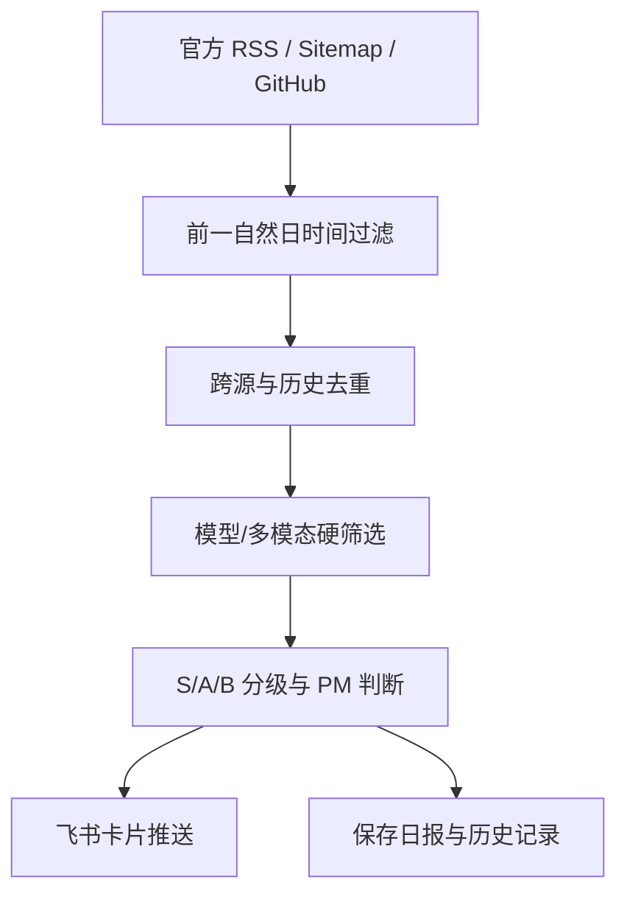

# AIan｜AI 产品经理模型雷达

一个适合 AI 产品经理作品集展示的自动化 Agent：每天采集全球大模型、Agent、AI 编程、
图像、视频与语音模型的官方动态，使用 GitHub Models 完成筛选和产品判断，去重后推送到飞书群。

## 核心能力

- **多源采集**：官方 RSS、官方站点 Sitemap、官方 GitHub Releases。
- **严格时间窗**：每天 09:07（UTC+8）检查前一个自然日 00:00–23:59。
- **模型导向筛选**：重点识别模型版本、能力边界、API/价格、多模态与 AIGC 更新。
- **AI 分析**：用 GitHub Models 将动态分为 S/A/B 三级，并生成“核心变化、PM 判断、建议动作”。
- **可信与去重**：只收录带官方原始链接的内容；利用 `data/history.json` 避免重复推送。
- **企业 IM 触达**：以飞书交互卡片推送到指定群聊。
- **无更新静默**：没有经官方核验的有效更新时只保存记录，不打扰飞书群。
- **低成本运行**：GitHub Actions + GitHub Models 免费原型额度，不需要 Skywork。

## 运行流程



## 第一次配置

### 1. 添加飞书 Webhook Secret

进入本仓库：

`Settings` → `Secrets and variables` → `Actions` → `New repository secret`

- Name：`FEISHU_WEBHOOK`
- Secret：飞书群自定义机器人的完整 Webhook 地址

请勿把 Webhook 写进代码、README、Issue 或提交记录。飞书机器人配置了自定义关键词时，
请使用 `AI前沿日报`；本项目所有卡片都包含该关键词。

### 2. 合并代码后手动测试

进入 `Actions` → `AI前沿日报` → `Run workflow`。`report_date` 可留空；留空时自动检查前一天。

有有效更新时，飞书群会收到一张日报卡片；无更新时保持静默。仓库的 `reports/` 与
`data/history.json` 会自动更新。

## 定时规则

工作流位于 `.github/workflows/daily-ai-news.yml`：

- Cron：`7 1 * * *`
- 执行时间：每天 UTC 01:07，即 UTC+8 的 09:07
- 手动运行：支持指定 `YYYY-MM-DD`，便于补跑某一天

## 收录标准

- 模型或明确版本的发布、升级、下线与可用范围变化
- 推理、编程、Agent、视觉、图像、视频、语音等能力的实质变化
- API endpoint、上下文、价格、限流、区域或商用权限变化
- AIGC 图像/视频在时长、分辨率、镜头控制、一致性、参考编辑、口型、原生音频等方面的更新
- 官方开放权重、许可证、推理方式或关键基准变化

以下内容默认排除：企业客户案例、融资招聘、一般公司新闻、泛基础设施合作、没有可用模型或
产品的研究、普通 SDK 维护与 alpha 小补丁、教程/SEO/比较文章、营销活动、观点和传闻。

## S/A/B 分级

- **S**：旗舰模型正式发布；多模态生成能力出现代际提升；重要 API、价格、可用性或安全政策变化
- **A**：重要模型版本或关键能力升级；重要开源模型；图像或视频能力明显增强
- **B**：与模型选型有关、但影响范围较小的能力或可用范围扩展

## 监控范围

- 全球模型：OpenAI、Google AI / DeepMind、Anthropic、Meta、Mistral、Hugging Face、FLUX 等
- 国内模型：Qwen、豆包 / ByteDance Seed、DeepSeek、智谱 GLM、腾讯混元、Kimi、MiniMax 等
- Agent / AI 编程：Codex、Claude Code、Gemini CLI、MCP、LangGraph、AutoGen 等
- 多模态与 AIGC：FLUX、Midjourney、Stability AI、Runway、Luma AI、PixVerse、ComfyUI、
  LTX Video、Wan Video 等

可在 `config/sources.json` 增删信源。部分厂商没有公开 RSS，因此以官方 Sitemap 或官方
GitHub Releases 补充；没有稳定官方机器可读信源的平台不会用媒体爆料强行补齐。单个信源失败
不会中断整份日报。

## 飞书日报字段

日报总表包含：`平台 | 模型/产品 | 级别 | 核心变化 | 类型 | 官方来源`。

每条卡片包含：

- 模型/产品
- 核心变化
- PM 判断
- 建议动作
- 官方来源

## 本地验证

```bash
python -m unittest discover -s tests -v
```

本项目仅使用 Python 标准库，不需要安装额外依赖。

## 费用说明

GitHub Models 提供有速率限制的免费原型用量，GitHub Actions 也受账户免费额度限制。
每日运行一次通常适合作品集 Demo，但免费额度和公测政策可能调整；若模型调用失败，Agent
会自动切换到关键词规则完成日报，不会让整条链路直接中断。
