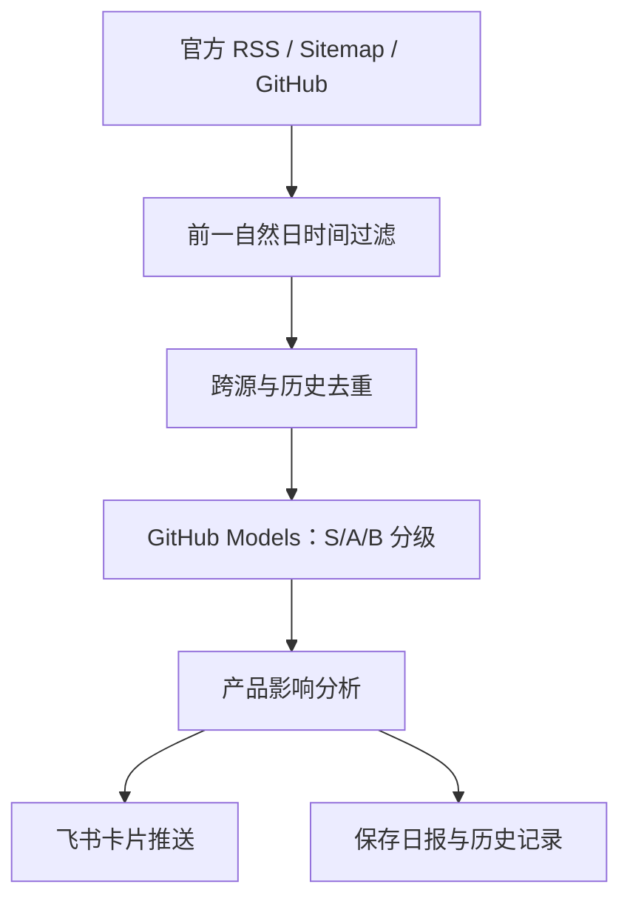

# AIan｜AI 前沿资讯 Agent

一个适合 AI 产品经理作品集展示的自动化 Agent：每天采集全球大模型、Agent、AI 编程与
AIGC 视频的官方动态，使用 GitHub Models 完成筛选和产品影响分析，去重后推送到飞书群。

## 核心能力

- **多源采集**：官方 RSS、官方站点 Sitemap、官方 GitHub Releases。
- **严格时间窗**：每天 09:00（UTC+8）检查前一个自然日 00:00–23:59。
- **AI 分析**：用 GitHub Models 将动态分为 S/A/B 三级，并生成“发生了什么、为什么重要、
  对 AI 产品的影响”。
- **可信与去重**：只收录带官方原始链接的内容；利用 `data/history.json` 避免重复推送。
- **企业 IM 触达**：以飞书交互卡片推送到指定群聊。
- **低成本运行**：GitHub Actions + GitHub Models 免费原型额度，不需要 Skywork。

## 运行流程



## 第一次配置

### 1. 添加飞书 Webhook Secret

进入本仓库：

`Settings` → `Secrets and variables` → `Actions` → `New repository secret`

- Name：`FEISHU_WEBHOOK`
- Secret：飞书群自定义机器人的完整 Webhook 地址

请勿把 Webhook 写进代码、README、Issue 或提交记录。飞书机器人配置了自定义关键词时，
请使用 `AI前沿日报`；本项目所有卡片都包含该关键词。

### 2. 合并代码后手动测试

进入 `Actions` → `AI前沿日报` → `Run workflow`。`report_date` 可留空；留空时自动检查前一天。

测试成功后，飞书群会收到一张日报卡片，仓库的 `reports/` 与 `data/history.json` 也会自动更新。

## 定时规则

工作流位于 `.github/workflows/daily-ai-news.yml`：

- Cron：`0 1 * * *`
- 执行时间：每天 UTC 01:00，即 UTC+8 的 09:00
- 手动运行：支持指定 `YYYY-MM-DD`，便于补跑某一天

## 监控范围

- 全球模型：OpenAI、Google AI / DeepMind、Anthropic、Meta、Mistral、Hugging Face 等
- 国内模型：Qwen、DeepSeek、智谱 GLM、腾讯混元、Kimi、MiniMax 等官方开源渠道
- Agent / AI 编程：Codex、Claude Code、Gemini CLI、MCP、LangGraph、AutoGen 等
- AIGC 视频：Runway、Stability AI、ComfyUI、LTX Video、Wan Video 等

可在 `config/sources.json` 增删信源。部分厂商没有公开 RSS，因此以官方 Sitemap 或官方
GitHub Releases 补充；单个信源失败不会中断整份日报。

## 本地验证

```bash
python -m unittest discover -s tests -v
```

本项目仅使用 Python 标准库，不需要安装额外依赖。

## 费用说明

GitHub Models 提供有速率限制的免费原型用量，GitHub Actions 也受账户免费额度限制。
每日运行一次通常适合作品集 Demo，但免费额度和公测政策可能调整；若模型调用失败，Agent
会自动切换到关键词规则完成日报，不会让整条链路直接中断。
