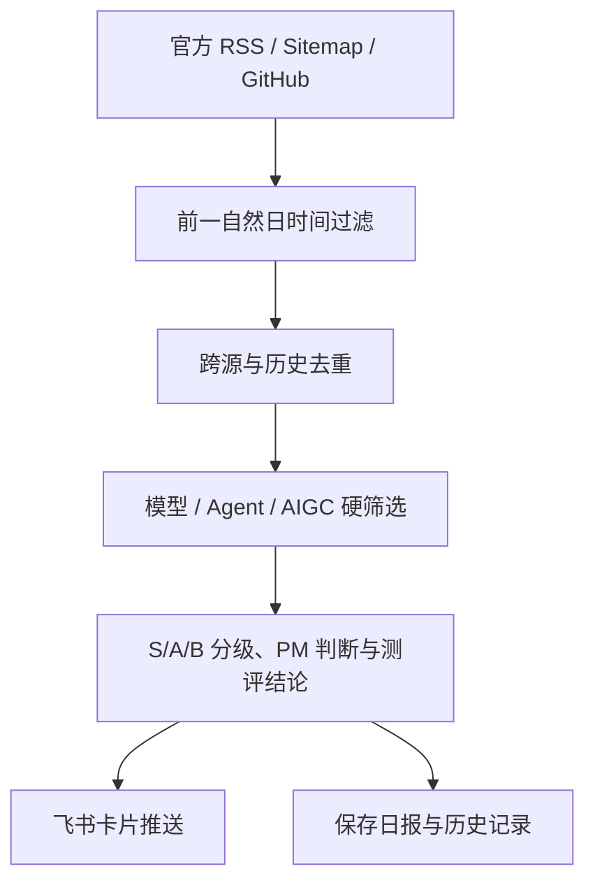

# AIan｜AI 模型、Agent 与 AIGC 雷达

一个适合 AI 产品经理作品集展示的自动化 Agent：持续采集重要通用/文本模型、Agent 与 AI 编程、
API/价格、多模态和 AIGC 的官方动态，使用 GitHub Models 完成筛选和产品判断，去重后推送到飞书群。

## 核心能力

- **多源采集**：官方 RSS、官方站点 Sitemap、官方 GitHub Releases。
- **每日必达**：每天 09:00（UTC+8）开始生成前一自然日的日报；主任务提前唤醒，并通过两次补偿检查降低 GitHub 定时延迟与漏跑风险。
- **实时雷达**：每小时第 23 分钟扫描当天重大 AI 产品与模型发布；S/A 级立即推送飞书，B 级保留到次日晨报。
- **产品经理筛选**：识别重要通用模型、Agent 核心能力、API/价格及多模态/AIGC 的关键变化。
- **AI 分析**：用 GitHub Models 将动态分为 S/A/B 三级，并生成“核心变化、PM 判断、测评优劣、建议动作”。
- **可信与去重**：只收录带官方原始链接的内容；利用 `data/history.json` 避免重复推送。
- **企业 IM 触达**：以飞书交互卡片推送到指定群聊。
- **无更新也确认**：没有经官方核验的有效更新时，仍会推送“今日无重要更新”，方便确认任务正常运行。
- **低成本运行**：GitHub Actions + GitHub Models 免费原型额度，不需要 Skywork。

## 运行流程


```mermaid
flowchart TD
    A["官方 RSS / Sitemap / GitHub"] --> B["前一自然日时间过滤"]
    B --> C["跨源与历史去重"]
    C --> D["模型 / Agent / AIGC 硬筛选"]
    D --> E["S/A/B 分级、PM 判断与测评结论"]
    E --> F["飞书卡片推送"]
    E --> G["保存日报与历史记录"]
```

## 第一次配置

### 1. 添加飞书 Webhook Secret

进入本仓库：

`Settings` → `Secrets and variables` → `Actions` → `New repository secret`

- Name：`FEISHU_WEBHOOK`
- Secret：飞书群自定义机器人的完整 Webhook 地址

请勿把 Webhook 写进代码、README、Issue 或提交记录。飞书机器人配置了自定义关键词时，
请使用 `AI前沿日报`；本项目所有卡片都包含该关键词。

### 2. 合并代码后手动测试

进入 `Actions` → `AI前沿日报` → `Run workflow`。`report_date` 可留空；留空时自动检查前一天。

同一天的日报默认不会重复发送；需要重新测试飞书时，可打开 `force_send`。有有效更新时发送完整
日报，没有有效更新时发送“今日无重要更新”。仓库的 `reports/` 与 `data/history.json` 会自动更新。

## 定时规则

工作流位于 `.github/workflows/daily-ai-news.yml`：

- 主任务：每天 UTC 00:45（UTC+8 的 08:45）提前唤醒，等待到 09:00 后开始生成和推送
- 补偿任务：每天 UTC 01:12、01:32（UTC+8 的 09:12、09:32）检查
- 防重复：当天报告已成功推送并归档后，后续补偿任务自动跳过
- 手动运行：支持指定 `YYYY-MM-DD`；默认防重复，也可选择强制重发

GitHub Actions 的定时任务不提供严格的秒级准时保证；提前唤醒和两次补偿可显著降低整点排队与
偶发漏跑风险。正常情况下飞书会在 09:00 后数分钟内收到日报。

实时工作流位于 `.github/workflows/realtime-model-releases.yml`：

- 每小时第 23 分钟扫描，避开整点队列高峰
- 首次运行仅扫描当天，后续覆盖今天与昨天，防止午夜附近发布漏报
- 只实时推送 S/A 级重大更新，并使用独立历史文件去重
- 实时提醒不会影响次日 09:00 的完整日报归档

## 收录标准

- 重要通用模型、文本模型、推理模型和基础模型的正式发布、关键升级、下线与可用范围变化
- Agent、AI 编程与智能体平台在工具调用、计算机/浏览器操作、多 Agent、子 Agent、长任务、
  记忆、MCP 等核心能力上的重要更新
- 多模态、视觉语言、图像、视频、音频或语音生成模型的发布、升级、下线与可用范围变化
- API 上下线、模型端点、Token 价格、限流、上下文窗口、区域、商用权限或开放权重变化
- 会影响模型选型、接入成本、产品方案或用户体验的官方基准、案例与能力边界变化

以下内容默认排除：企业客户案例、融资招聘、一般公司新闻、泛基础设施合作、没有可用模型或
产品的研究、普通 SDK/CLI 维护与小补丁、alpha/beta/nightly、常规 bug 修复、教程/SEO/
比较文章、营销活动、观点和传闻，以及服务故障、状态页告警、错误率和恢复进展。

## S/A/B 分级

- **S**：旗舰通用/多模态模型正式发布、代际能力提升，或重要 Agent 平台出现范式级变化
- **A**：重要模型版本、Agent 核心能力、API/价格或可用范围发生会影响产品选型的明确变化
- **B**：具备产品决策价值、但影响相对有限的能力、接入或开放范围更新；普通补丁不收录

## 监控范围

- 综合模型：OpenAI、Google AI / DeepMind、Anthropic、Meta、Mistral、Hugging Face 等，
  同时覆盖重要通用/文本/推理模型和多模态更新
- Agent 与 AI 编程：OpenAI Codex、Anthropic Claude Code、Google Gemini CLI，以及综合官方源
  中的重要智能体平台和 Agent 能力更新
- 图像与视频：FLUX、Midjourney、Stability AI、Runway、Luma AI、PixVerse、ComfyUI、
  LTX Video、Wan Video 等
- 国内模型与多模态：Qwen、豆包 / ByteDance Seed、智谱、腾讯混元等

可在 `config/sources.json` 增删信源。部分厂商没有公开 RSS，因此以官方 Sitemap 或官方
GitHub Releases 补充；没有稳定官方机器可读信源的平台不会用媒体爆料强行补齐。单个信源失败
不会中断整份日报。

## 飞书日报字段

日报总表包含：`平台 | 模型/产品 | 级别 | 核心变化 | 类型 | 官方来源`。

每条卡片包含：

- 模型/产品
- 核心变化
- PM 判断
- 测评依据（官方基准 / 官方案例 / 待实测）
- 测评优点
- 测评不足
- 建议动作
- 官方来源

## 本地验证

```bash
python -m unittest discover -s tests -v
```

本项目仅使用 Python 标准库，不需要安装额外依赖。

“测评优点/测评不足”不会默认视为独立实测：只有官方原文明确给出基准或案例时才会标注
“官方基准/官方案例”；其他更新统一标注“待实测”，并给出后续验证方向，避免把厂商宣传
写成已经验证的结论。

## 费用说明

GitHub Models 提供有速率限制的免费原型用量，GitHub Actions 也受账户免费额度限制。
每日运行一次通常适合作品集 Demo，但免费额度和公测政策可能调整；若模型调用失败，Agent
会自动切换到关键词规则完成日报，不会让整条链路直接中断。
